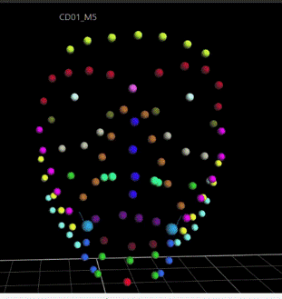

# Face_Motion_Capture

Applying Machine Learning to face motion capture data.

This repository is an example of Anomaly Detection Software for Facial Movement Assessment, called “DeepSmile: Anomaly Detector”. The software has an integrated trained LSTM model. The model predicts healthy smiles since it was trained on a dataset that contains healthy smiles using the One-Class strategy.
The 3D data was captured using a motion capture system.

This repository contains:

- **LSTM_smile**: this folder contains data preprocessing scripts and experiments comparing Baseline and the best trained LSTM model.
- **DeepSmile**: this folder is the source code of the software.

## Pipeline

## How to reproduce

To evaluate facial movement, the following steps must be followed.
1. Markers are placed on the patient's face, as for a motion capture session, (see pipeline).
2. The patient is asked to smile while writing markers.
3. Markers are marked and exported to a csv file.
Finally, the csv file is uploaded to DeepSmile through its GUI and a report is generated based on the LSTM score.

**Launching the software**:

- Download the archive  [DeepSmile](https://drive.google.com/file/d/1LHC0isDdlVEOu2xm7c39yGxJ7oFKVDm2/view?usp=sharing) containing softwarethe for Windows and the trained model.  Extract the archive folder.
- Run `DeepSmile.exe`  to determine the extent of the anomaly.

## Results
 
Once the assessment is finished, DeepSmile provides a report that contains:

- the data of the patient; 
- the trajectory and performance of each marker; 
- a normalized and metric degree of anomaly; 
- a discrete indicator of relevant anomaly.

## Dependencies

You will require:

- Python version 3.8.10 or later; 
- Windows 10.

## References

1. Adolphs N., Haebel and all. (2014). Virtual planning for craniomaxillofacial surgery–7 years of experience. Journal of CranioMaxillofacial Surgery, 42(5), e289–e295.
2. Sarhan F.-R. (2017). Quantification des mouvements de la mimique faciale par motion capture sur une population de volontaires sains. PhD thesis, Compiègne. 
3. Olivetto, M., Sarhan, F. R., Mansour, K. B., Marie, J. P., Marin, F., & Dakpé, S. (2019). Quantitative Analysis of Facial Palsy Based on 3D Motion Capture (SiMoVi-FaceMoCap Project). Archives of Physical Medicine and Rehabilitation, 100(10), e112.

## Contacts

|Name                             |Email Address           |
|---------------------------------|------------------------|
|Eder Alejandro Rodríguez Martínez|eder_rdz_mtz@hotmail.com|
Olga Polezhaeva|olga.tchernichencko@gmail.com|