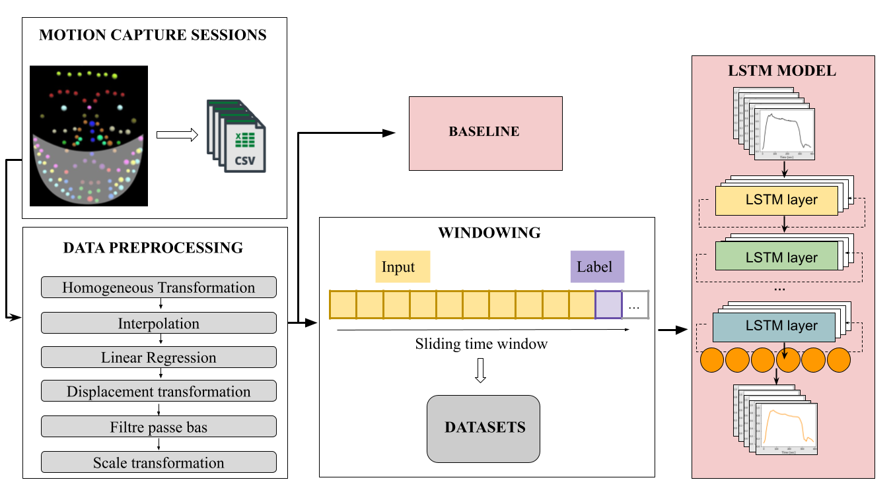

# Face_Motion_Capture

Applying Machine Learning to face Motion Capture Data.

This repository is an example of Anomaly Detection Software for Facial Movement Assessment, called “DeepSmile: Anomaly Detector”. The software has an integrated trained LSTM model. The model predicts healthy smiles since it was trained on a dataset that contains healthy smiles using the One-Class strategy.
The 3D data was captured using a motion capture system.

This repository contains:

- **LSTM_smile**: this folder contains data preprocessing scripts and experiments comparing Baseline and the best trained LSTM model.
- **DeepSmile**: this folder is the source code of the software.

## Pipeline

## How to reproduce:

1. Download the archive  [DeepSmile](https://drive.google.com/file/d/1LHC0isDdlVEOu2xm7c39yGxJ7oFKVDm2/view?usp=sharing) containing softwarethe for Windows and the trained model.  Extract the archive folder.
2. Run `DeepSmile.exe`  to determine the extent of the anomaly.

## Results
 
Once the assessment is finished, DeepSmile provides a report that contains:

- the data of the patient; 
- the trajectory and performance of each marker; 
- a normalized and metric degree of anomaly; 
- a discrete indicator of relevant anomaly.

## Dependencies

You will require:

- Python version 3.8.10 or later; 
- Windows 10

## References

**ARTICLE**

## Contacts

|Name                             |Email Address           |
|---------------------------------|------------------------|
|Eder Alejandro Rodríguez Martínez|eder_rdz_mtz@hotmail.com|
Olga Polezhaeva|olga.tchernichencko@gmail.com|